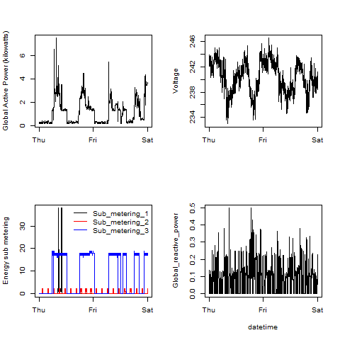

Exploratory-Data-Analysis
=========================

Programming assignments for the course, June7, 2015

prepareData.R will used to download and prepare the data for the plots.

###Plot1.R

###Plot2.R

###Plot3.R

###Plot4.R

